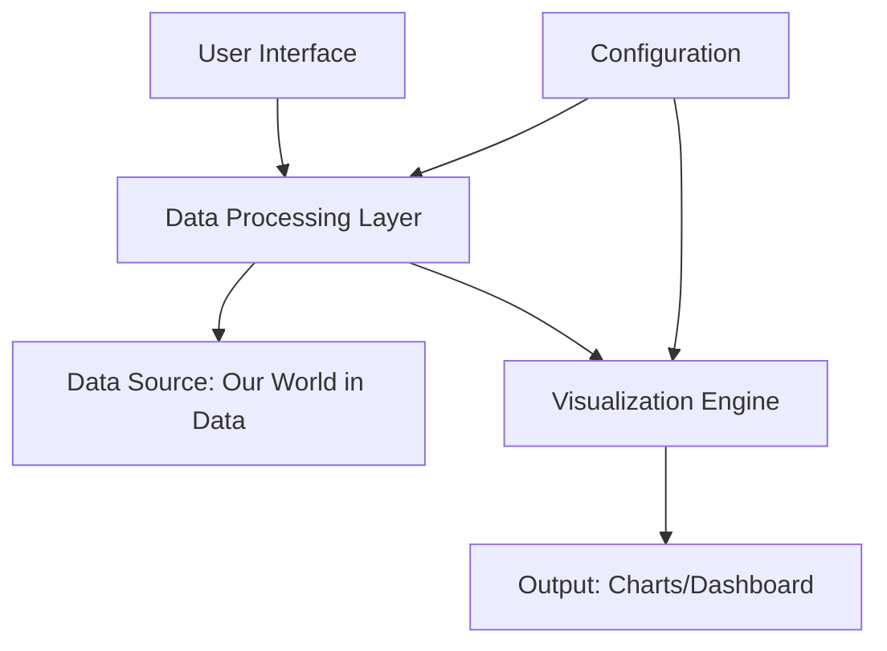
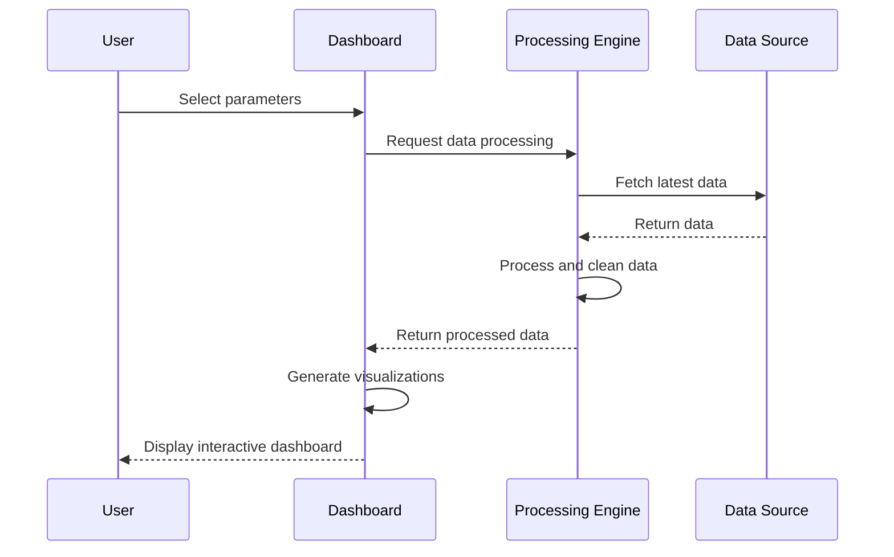

# Improving the Presentation of the COVID-19 Visualization Project

## Overview

This document outlines a strategy to enhance the presentation of the current COVID-19 data visualization project. The existing implementation generates basic visualizations but lacks a comprehensive presentation structure that would make the project more accessible, informative, and professional.

## Current State Analysis

The project currently consists of:
- A Python script that fetches data from Our World in Data
- Generates two visualizations:
  1. Bar chart showing average deaths per million by continent
  2. Line chart comparing smoothed new cases between Europe and Asia
- Lacks documentation, structured presentation, and user guidance

## Proposed Improvements

### 1. Documentation Enhancement

#### README.md Creation
Create a comprehensive README file that includes:
- Project overview and objectives
- Data sources and methodology
- Installation and usage instructions
- Interpretation guide for visualizations
- Technical requirements and dependencies

### 2. Interactive Dashboard Development

#### Web-based Interface
Develop an interactive dashboard using:
- Streamlit or Dash for Python-based web applications
- Interactive controls for selecting countries/continents
- Date range selectors for time-series analysis
- Multiple visualization types in a single interface

### 3. Enhanced Visualization Strategy

#### Additional Chart Types
Expand beyond the current two visualizations to include:
- Heatmaps showing global spread over time
- Scatter plots comparing vaccination rates vs. death rates
- Stacked area charts for case progression by continent
- Interactive maps using libraries like Plotly or Folium

#### Visualization Improvements
- Consistent color schemes and styling
- Responsive design for different screen sizes
- Export functionality for generated charts
- Annotations and contextual information

### 4. Presentation Materials

#### Executive Summary Document
Create a summary document that includes:
- Key findings from the data analysis
- Methodology overview
- Visual highlights with explanations
- Recommendations for further analysis

#### Slide Deck
Develop a presentation slide deck with:
- Project introduction and objectives
- Data source explanation
- Key visualizations with insights
- Conclusions and future work

### 5. Code Structure Improvement

#### Modularization
Refactor the monolithic script into:
- Data fetching module
- Data processing module
- Visualization generation module
- Main application orchestration

#### Configuration Management
- External configuration files for data sources
- Customizable visualization parameters
- Environment-specific settings

## Implementation Architecture

## Data Flow Enhancement

## Technology Stack Recommendations

| Component | Current | Proposed | Reason |
|-----------|---------|----------|---------|
| Data Processing | Pandas | Pandas + Dask | Better performance with large datasets |
| Visualization | Matplotlib | Plotly/Dash | Interactive capabilities |
| Web Framework | None | Streamlit | Rapid development of data apps |
| Deployment | Local | Docker + Cloud | Accessibility and scalability |

## User Experience Improvements

### Interface Design
- Intuitive controls for filtering data
- Responsive layout for desktop and mobile
- Loading indicators during data fetch
- Error handling and user feedback

### Accessibility Features
- Colorblind-friendly palettes
- Keyboard navigation support
- Screen reader compatibility
- Text alternatives for visual content

## Testing Strategy

### Unit Testing
- Data fetching functionality
- Data processing functions
- Visualization generation methods

### Integration Testing
- End-to-end dashboard workflows
- Data consistency checks
- Performance benchmarks

### User Acceptance Testing
- Usability testing with target audience
- Feedback collection mechanisms
- Iterative improvement process

## Deployment and Distribution

### Local Development
- Clear setup instructions
- Virtual environment configuration
- Dependency management

### Production Deployment
- Containerization with Docker
- Cloud deployment options (Heroku, AWS, GCP)
- Automated deployment pipelines

## Future Enhancement Opportunities

### Machine Learning Integration
- Predictive modeling for case progression
- Clustering countries by pandemic response
- Anomaly detection in data trends

### Real-time Data Processing
- WebSocket integration for live updates
- Push notifications for significant changes
- Streaming data architecture

### Social Sharing Features
- Export visualizations to social media
- Generate report PDFs
- Embeddable chart widgets

## Conclusion

These improvements will transform the current basic visualization script into a comprehensive, interactive, and professionally presented data analysis project. The enhancements focus on user experience, technical robustness, and presentation quality to better communicate the insights from the COVID-19 data.