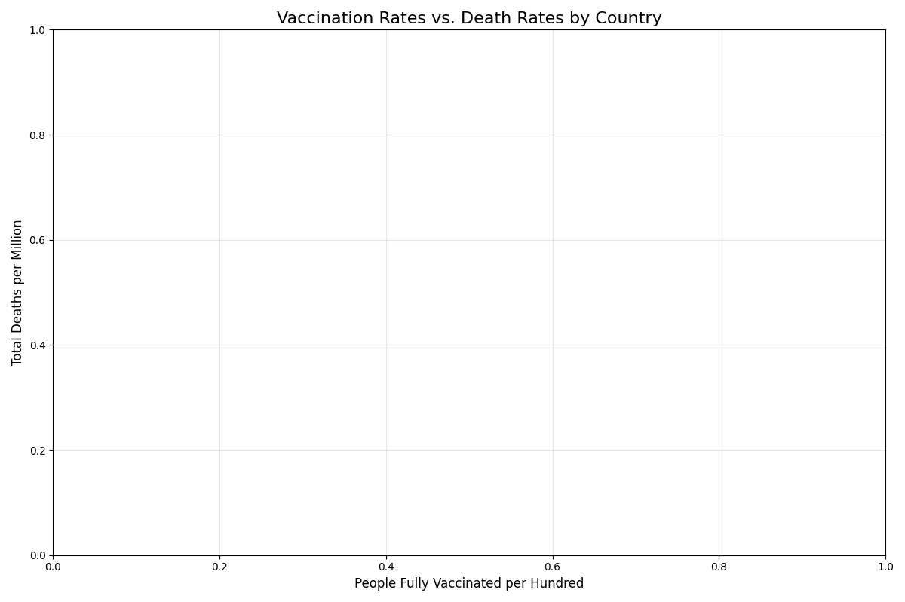
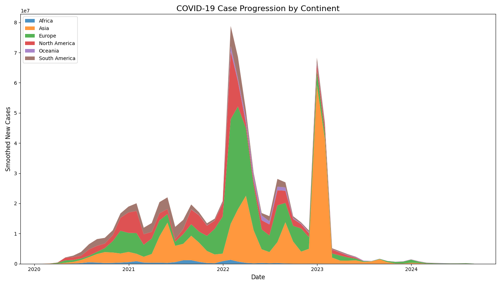

# COVID-19 Data Visualization Project

## Slide 1: Title Slide
**Visualizing a Global Pandemic: An Interactive Analysis of COVID-19 Trajectories**

Presented by: [Your Name]
Date: [Presentation Date]

---

## Slide 2: Project Overview
- **Objective**: Analyze and visualize global COVID-19 data to understand pandemic impact
- **Data Source**: Our World in Data (comprehensive dataset from national health ministries)
- **Approach**: Multiple visualization types to reveal different aspects of the pandemic
- **Outcome**: Interactive dashboard for real-time data exploration

---

## Slide 3: Key Insights - Regional Impact

- Europe and North America experienced the highest death rates
- Africa and South America showed comparatively lower impact
- Asia demonstrated varied outcomes across countries

---

## Slide 4: Key Insights - Temporal Patterns

- Distinct waves with varying intensity across regions
- Correlation between new variants and case surges
- Effect of public health interventions visible in the data

---

## Slide 5: Vaccination Impact Analysis

- Strong correlation between vaccination rates and reduced death rates
- Countries with higher vaccination rates showed more resilient healthcare systems
- Breakthrough infections were generally less severe

---

## Slide 6: Case Progression Over Time

- Different continents experienced peaks at different times
- Europe and North America had early significant waves
- Asia's pattern was more varied across countries

---

## Slide 7: Technical Implementation
**Architecture**
- Modular design with separate components for data fetching, processing, and visualization
- Interactive dashboard built with Streamlit
- Responsive design for different devices
- Export functionality for sharing results

**Technology Stack**
- Python with Pandas and Matplotlib
- Streamlit for web interface
- Plotly for interactive visualizations

---

## Slide 8: Interactive Dashboard Features
- **Real-time Data**: Direct connection to Our World in Data's live dataset
- **Customizable Filters**: Date ranges, continents, and countries
- **Multiple Chart Types**: Bar charts, line graphs, scatter plots, and area charts
- **Export Capability**: Download data and charts for further analysis

---

## Slide 9: Future Enhancements
1. **Predictive Modeling**: Machine learning to forecast case trends
2. **Geographic Visualization**: Interactive maps showing spread over time
3. **Real-time Alerts**: Notifications for significant changes in data
4. **Social Sharing**: Easy export to social media platforms
5. **Mobile App**: Dedicated mobile application for on-the-go access

---

## Slide 10: Conclusion
- This project successfully transforms raw COVID-19 data into meaningful visualizations
- The interactive dashboard enables deeper exploration of the pandemic's impact
- The modular architecture provides a foundation for ongoing analysis
- The visualizations help communicate complex data to diverse audiences

---

## Slide 11: Questions & Discussion
**Thank you for your attention!**

Questions and discussion welcome.

Contact: [Your Email]
Repository: [GitHub URL if applicable]